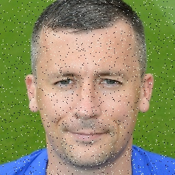
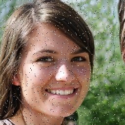
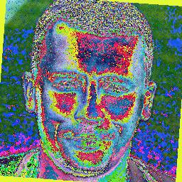
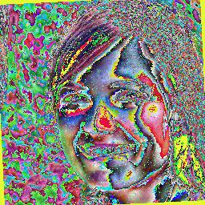
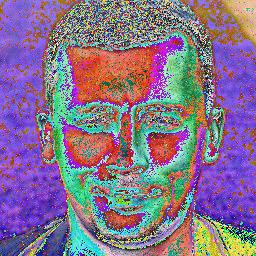
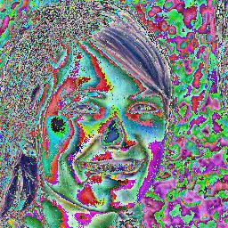
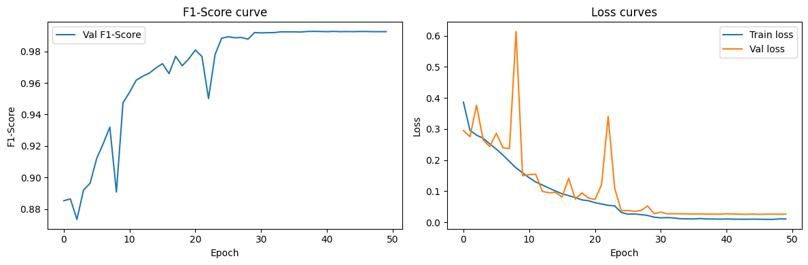

# **Обнаружение Deepfake изображений**

## **Обзор проекта**

#### Данный проект посвящён **бинарной классификации изображений для обнаружения deepfake** с использованием глубокого обучения.

Цель проекта - построить эффективную сверточную нейронную сеть, способную различать 
**реальные изображения от сгенерированных**.

### Примеры изображений

| **Реальное**             | **Cгенерированное**     |
|--------------------------|-------------------------|
|  |   |

В ходе выполнения программы к этим изображениям будут применяться различные преобразования (аугментации)
для улучшения обобщающей способности и продуктивности модели.

Модель написана с использованием **PyTorch**.

Финальная модель достигает примерно **F1-Score = 0.9927 на валидационной выборке
(с искуственно увеличенным и сбалансированным датасетом)**.

---

## Структура проекта

```
YaML-Deepfake/
│
├── main.ipynb                     # Основной ноутбук обучения
│
├── data/
│   └── dataset/                   # Директория с датасетом
│       ├── new_train_images/
│       ├── test_images/
│       ├── train_images/
│       ├── new_train_solution.csv
│       └── train_solution.csv
│
├── weights/                       # Сохранённые веса модели
│   └── model_weights.pth
│
├── submission/
│   └── submission.csv             # Файл решения
│
├── README.md                      # Документация проекта
│
└── utils/
    ├── util_testing.ipynb         # Ноутбук с реализованным пересозданием датасетом
    ├── dataset.py                 # Загрузчик датасета
    └── models/                    
        └── models.py              # Ранее использованные архитектуры
```

---

## Датасет

Датасет состоит из изображений с двумя классами:
- **0**: Реальное фото;
- **1**: Сгенерированное изображение.

В силу несбалансированности классов в датасете мы решили искуственно увеличить его, 
путем мультипликации и применения преобразований к текущим сгенерированным изображениям.  

**Структура датасета:**

```
dataset/                     # Директория с датасетом
│
├── test_images/             # Тестовый датасет
│
├── train_images/            # Оригинальный датасет с данными для обучения
│
├── new_train_images/        # Искуственно увеличенный сбалансированный датасет для обучения
│
├── train_solution.csv       # Файл с данными о классах изображений из тренировочного датасета
│
└── new_train_solution.csv   # Увеличенный файл с данными о классах изображений из тренировочного датасета
```

Изображения загружаются с помощью **кастомного класса Dataset в PyTorch**,
что позволяет гибко управлять предобработкой и аугментациями.

---

## Pipeline обработки данных

### Аугментации (Train)

Для улучшения обобщающей способности модели применяются следующие аугментации на тренировочных данных:

```python
train_transform = transforms.Compose([
    transforms.Resize(256),
    transforms.RandomHorizontalFlip(p=0.5),
    transforms.RandomRotation(degrees=15),
    transforms.ColorJitter(
        brightness=0.2,
        contrast=0.2,
        saturation=0.2,
        hue=0.1
    ),
    transforms.ToTensor(),
    transforms.Normalize(
        mean=[0.485, 0.456, 0.406],
        std=[0.229, 0.224, 0.225]
    )
])
```
### Примеры преобразованных изображений для тренировки модели
| **Реальное**                 | **Cгенерированное**        |
|------------------------------|----------------------------|
|  |  |

---

### Преобразования для валидации

Для валидации используется минимальная предобработка:

```python
base_transform = transforms.Compose([
    transforms.Resize(256),
    transforms.ToTensor(),
    transforms.Normalize(
        mean=[0.485, 0.456, 0.406],
        std=[0.229, 0.224, 0.225]
    )
])
```
### Примеры преобразованных изображений для валидационных данных
| **Реальное**                     | **Cгенерированное**            |
|----------------------------------|--------------------------------|
|  |  |

---

## Архитектура модели

Модель представляет собой **легкую CNN-архитектуру**, с использованием **Residual Blocks**.

Основные цели архитектуры:

* высокая скорость обучения
* эффективное использование памяти
* хорошее качество без предобученных весов

### Основные компоненты модели

* сверточные слои (Conv2D)
* Batch Normalization
* функция активации ReLU
* Residual Blocks
* Global Average Pooling и Downsampling
* полносвязный классификатор

Пример структуры модели:

```
1) 256*256*3

2) ResBlock(3, 32)  + AvgPool

3) ResBlock(32, 64) + AvgPool

4) ResBlock(64, 128) + AvgPool

5) ResBlock(128, 256) + AvgPool

6) ResBlock(256, 512) + AvgPool

7) Global Average Pooling

8) Linear(512, 1)
```

Такая архитектура уменьшает количество параметров, сохраняя высокую продуктивность сети.

---

## Обучение модели

### Функция потерь

Используется функция потерь для бинарной классификации:

```
BCEWithLogitsLoss
```

Она объединяет **sigmoid + binary cross entropy** в численно устойчивой форме.

---

### Оптимизатор

Конфигурация оптимизатора:

```python
OPTIMIZER = optim.AdamW(
    MODEL.parameters(),
    lr=LEARNING_RATE,
    weight_decay=1e-2
)
```

---

### Планировщик learning rate

Для улучшения сходимости используется scheduler:

```python
scheduler = optim.lr_scheduler.ReduceLROnPlateau(
    OPTIMIZER,
    mode="max", 
    factor=0.3,
    patience=2
)
```

Scheduler обновляет learning rate при отсутствии улучшения результата за последние 2 эпохи.

---

## Параметры DataLoader


```python
train_loader = DataLoader(
    train_dataset,
    batch_size=128,
    shuffle=True,
    num_workers=4,
    # pin_memory=True  # используется, при достаточном объёме ОЗУ
)
```

---

## Результаты

Текущие результаты обучения:

| Метрика              | Значение    |
|----------------------|-------------|
| Validation F1-score  | **0.9927**  |
| Количество эпох      | 50          |
| Время обучения       | 6 часов     |

**Графики обучения:**

---

## Возможные улучшения

* более сильные аугментации
* MixUp / CutMix
* более глубокая сеть

---

## Как запустить проект

### 1. Установка зависимостей

```bash
pip install -r requirements.txt
```

---

### 2. Подготовка датасета

Воспользуйтесь Python-скриптом, введя Kaggle Api: 

```bash
python utils/dataset.py
```

---

### 3. Запуск обучения

Откройте и запустите:

```
main.ipynb
```

или преобразуйте ноутбук в Python-скрипт.

---

## Вывод

Данный проект показывает, что **CNN**, 
может достигать хороших результатов в задаче обнаружения deepfake при правильной:

* архитектуре
* системе аугментаций
* стратегии обучения

---

## Авторы

Воробченко Артём<br/>
Ковалёв Сергей<br/>
Фролов Иван
